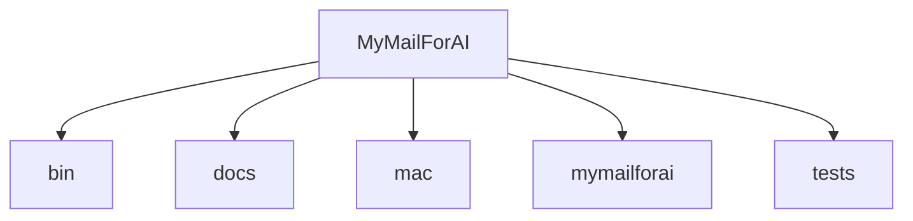
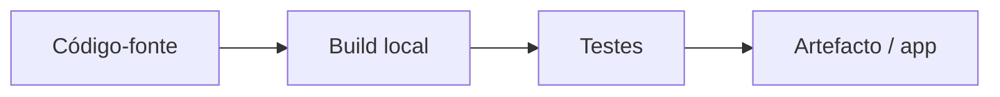

# Arquitetura — MyMailForAI

_Documentação gerada a partir do código em 2026-08-31. Não descreve planos futuros._

## Overview

Your own mailbox, full access for your agent, and the brake in the menu bar.

## Stack (detetada)

- (stack não detectado automaticamente — ver README e manifests)

## Estrutura de pastas

```
├── bin/
│   └── mymailforai
├── docs/
│   ├── i18n.js
│   ├── index.html
│   └── style.css
├── mac/
│   ├── MyMailForAI.app/
│   ├── Resources/
│   ├── Sources/
│   ├── Tools/
│   ├── build_app.sh
│   ├── make_icon.sh
│   └── Package.swift
├── mymailforai/
│   ├── __init__.py
│   ├── accounts.py
│   ├── actions.py
│   ├── approvals.py
│   ├── cli.py
│   ├── gate.py
│   ├── i18n.py
│   ├── identities.py
│   ├── imapc.py
│   ├── keychain.py
│   ├── mcp.py
│   ├── paths.py
│   ├── providers.py
│   └── smtpc.py
├── tests/
│   ├── fake_mail_server.py
│   └── test_fluxo.py
├── CONTRATO.md
├── install.sh
├── LICENSE
├── PEDIDOS.md
├── README.md
└── TRABALHO.md
```

## Diagrama de pastas de topo



## Documentação existente no repo

- `CONTRATO.md`
- `PEDIDOS.md`
- `README.md`
- `TRABALHO.md`

Comparar estes ficheiros com o código ao atualizar; marcar secções STALE se divergirem.

## Fluxo de desenvolvimento (genérico a partir dos artefactos)


