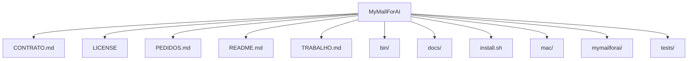

# Estrutura — MyMailForAI

## Pastas de topo

```
MyMailForAI/
├── CONTRATO.md
├── LICENSE
├── PEDIDOS.md
├── README.md
├── TRABALHO.md
├── bin/
├── docs/
├── install.sh
├── mac/
├── mymailforai/
├── tests/
```

## Diagrama



## Componentes / módulos importantes

_Sem pastas de módulo padrão detectadas._
